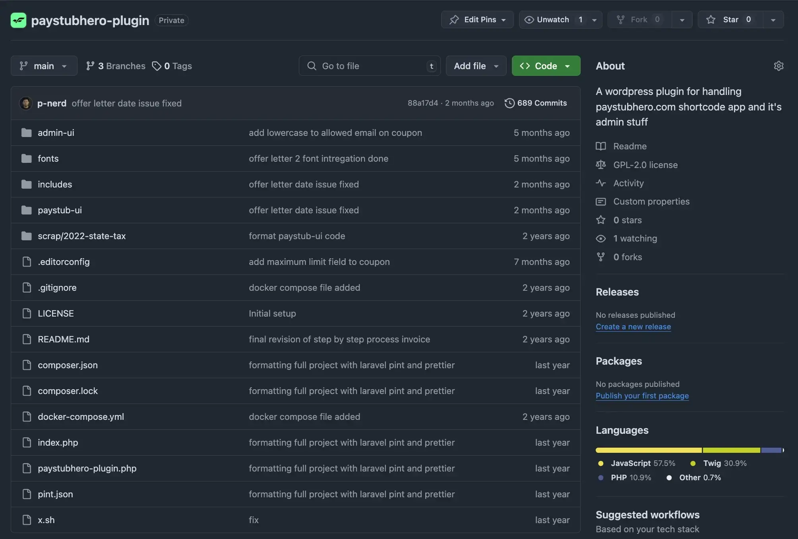

WordPress plugin developed for [PaystubHero.com](https://www.paystubhero.com)
that revolutionizes payroll document generation through seamless integration of [React](https://react.dev)
and WordPress technologies. This innovative solution, continuously maintained
and enhanced since May 2023, facilitates the creation of various essential
payroll documents including [Paystub](https://www.paystubhero.com/generate-pay-stubs),
[W-2 form](https://www.paystubhero.com/w-2-form-online-generator),
[1099 MISC form](https://www.paystubhero.com/1099-misc-form-generator),
[1099 NEC form](https://www.paystubhero.com/1099-nec-form-generator),
[Invoice](https://www.paystubhero.com/invoice-generator), and
[Offer Letter](https://www.paystubhero.com/offer-letter-generator).

The project showcases advanced technical implementation combining [WordPress](https://wordpress.org)'s
robust backend with a modern React frontend, integrated via shortcode for optimal performance.
Key technical features include a custom WordPress REST API for efficient frontend-backend communication,
secure payment processing through [Stripe](https://stripe.com), and PDF generation using mPDF library,
all styled with [TailwindCSS](https://tailwindcss.com) for a responsive user interface.

The solution demonstrates expertise in complex system integration, featuring seamless communication
between React components and WordPress functionalities. Through careful architecture and ongoing
optimization, the plugin maintains high performance while handling sensitive payroll data with
robust security measures. The implementation includes comprehensive error handling, and user-friendly
interfaces that simplify payroll management tasks.

This project stands as a testament to creating enterprise-grade WordPress plugins that leverage
modern JavaScript frameworks while maintaining WordPress's core functionality. The live implementation
can be experienced at [PaystubHero.com](https://www.paystubhero.com/generate-pay-stubs), where users can
access the full range of payroll document generation features.

